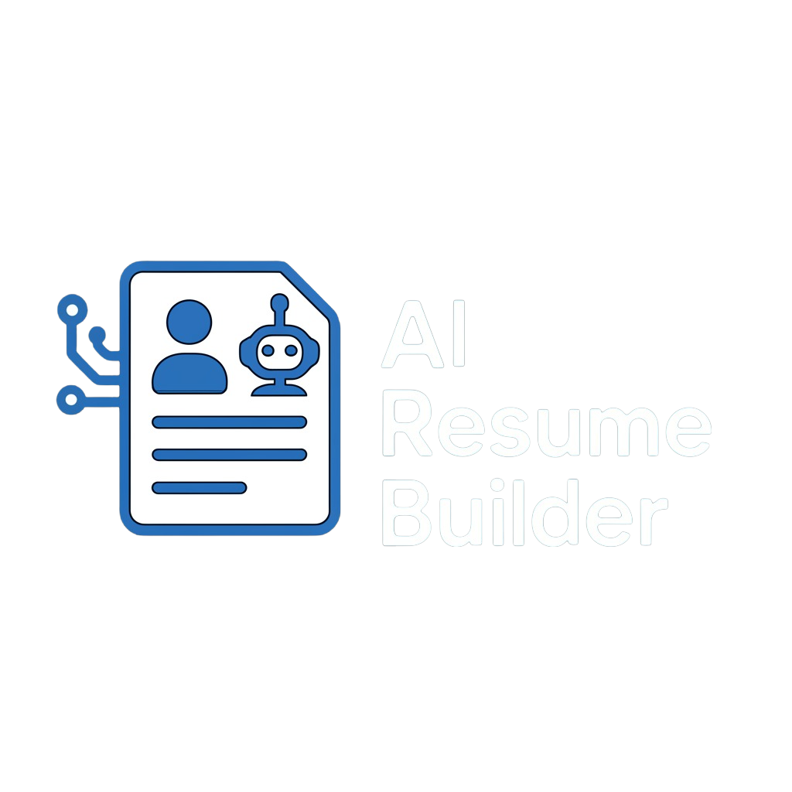

<a name="top"></a>
<div align="center">


# AI Resume Builder

### 🌟 Create professional, tailored resumes and cover letters with AI in any language

[English](#english) | [Italiano](#italiano)

[](https://www.python.org/downloads/)
[](LICENSE)

</div>

---

<a name="english"></a>
# English

## 📋 Table of Contents

1. [Introduction](#-introduction)
2. [Features](#-features)
3. [Installation](#-installation)
4. [Configuration](#️-configuration)
5. [Usage](#️-usage)
6. [Customization](#-customization)
7. [Troubleshooting](#-troubleshooting)
8. [License](#-license)

## 🚀 Introduction

AI Resume Builder is a powerful tool designed to help job seekers create professional, tailored resumes and cover letters using artificial intelligence in any language. The application analyzes job descriptions and customizes your resume to highlight the most relevant skills and experiences, increasing your chances of landing interviews. Whether you need a resume in English, Spanish, French, German, Italian, or any other language, AI Resume Builder has you covered.

## ✨ Features

- **AI-Powered Resume Generation**: Create tailored resumes based on job descriptions
- **Cover Letter Creation**: Generate personalized cover letters for specific job applications
- **Multiple Style Options**: Choose from various professional resume styles
- **PDF Export**: Export your documents in high-quality PDF format
- **Multilingual Support**: Create resumes in any language (English, Spanish, French, German, Italian, Chinese, Japanese, and many more)
- **Customizable Layout**: Control font sizes, margins, and spacing
- **Privacy-Focused**: Support for local LLM models through Ollama (works with lightweight 3B models)
- **Low Hardware Requirements**: Optimized to work with smaller models on modest hardware

## 💻 Installation

### Windows

1. **Prerequisites**:
   - [Python 3.10 or higher](https://www.python.org/downloads/)
   - [Google Chrome browser](https://www.google.com/chrome/)
   - [Git](https://git-scm.com/download/win) (optional, for updates)
   - [Visual C++ Build Tools](https://visualstudio.microsoft.com/visual-cpp-build-tools/) (select "Desktop development with C++")

2. **Installation**:
   - **Option 1: Using GUI**
     - Download this repository by clicking the green "Code" button on GitHub and selecting "Download ZIP"
     - Extract the ZIP file to a location of your choice
     - Navigate to the extracted folder
     - Double-click `install_requirements.bat`
     - The script will create a virtual environment and install all dependencies

   - **Option 2: Using Command Line**
     ```cmd
     # Clone the repository
     git clone https://github.com/dvelm/AI_Resume_Builder.git

     # Navigate to the project directory
     cd AI-Resume-Builder

     # Run the installation script
     install_requirements.bat
     ```

3. **Running the Application**:
   - **Option 1: Using GUI**
     - Double-click `run_app.bat` to start the application

   - **Option 2: Using Command Line**
     ```cmd
     # Navigate to the project directory (if not already there)
     cd AI-Resume-Builder

     # Run the application
     run_app.bat
     ```

### macOS / Linux

1. **Prerequisites**:
   - **macOS**:
     - [Python 3.10 or higher](https://www.python.org/downloads/macos/)
     - [Google Chrome browser](https://www.google.com/chrome/)
     - [Git](https://git-scm.com/download/mac) (optional, for updates)
     - [Homebrew](https://brew.sh/) (recommended for package management)

   - **Linux (Ubuntu/Debian)**:
     - Python 3.10 or higher: `sudo apt install python3 python3-pip python3-venv`
     - Google Chrome browser: `wget https://dl.google.com/linux/direct/google-chrome-stable_current_amd64.deb && sudo apt install ./google-chrome-stable_current_amd64.deb`
     - Git (optional): `sudo apt install git`

2. **Installation**:
   - **Option 1: Using GUI**
     - Download this repository by clicking the green "Code" button on GitHub and selecting "Download ZIP"
     - Extract the ZIP file to a location of your choice
     - Open a terminal in the extracted folder
     - Run the following commands:
       ```bash
       # Make the installation script executable
       chmod +x install_requirements.sh

       # Run the installation script
       ./install_requirements.sh
       ```

   - **Option 2: Using Terminal**
     ```bash
     # Clone the repository
     git clone https://github.com/dvelm/AI_Resume_Builder.git

     # Navigate to the project directory
     cd AI-Resume-Builder

     # Make the installation script executable
     chmod +x install_requirements.sh

     # Run the installation script
     ./install_requirements.sh
     ```

3. **Running the Application**:
   - **Using Terminal**
     ```bash
     # Navigate to the project directory (if not already there)
     cd AI-Resume-Builder

     # Make the run script executable (if not already)
     chmod +x run_app.sh

     # Run the application
     ./run_app.sh
     ```

## ⚙️ Configuration

### Required Files

All configuration files should be placed in the `data_folder` directory:

1. **secrets.yaml**:
   ```yaml
   # API key for the LLM service
   llm_api_key: "your-api-key-here"
   ```

2. **plain_text_resume.yaml**:
   This file contains your resume information in a structured format. Fill it out with your personal details, education, work experience, and skills.

   Example structure with explanations for each field:
   ```yaml
   personal_information:
     name: "John"                                    # Your first name
     surname: "Doe"                                  # Your last name
     date_of_birth: "01/01/1990"                     # Your birth date in DD/MM/YYYY format
     country: "United States"                        # Your country of residence
     city: "New York"                                # Your city of residence
     zip_code: "10001"                               # Your postal/zip code
     phone_prefix: "+1"                              # Your country calling code with + symbol
     phone: "5551234567"                             # Your phone number without spaces or dashes
     email: "john.doe@example.com"                   # Your email address
     github: "https://github.com/johndoe"            # Full URL to your GitHub profile
     linkedin: "https://www.linkedin.com/in/johndoe/" # Full URL to your LinkedIn profile
     # address: "123 Main St"                        # Your street address (commented out to exclude)

   education_details:                                # List of your educational qualifications
     - education_level: "Bachelor's Degree"           # Type of degree or certification
       institution: "University Name"                 # Name of the school, college, or university
       field_of_study: "Computer Science"             # Your major or area of study
       final_evaluation_grade: "3.8 GPA"              # Your final grade or GPA
       year_of_completion: 2020                       # Year you completed this education (number)
       start_date: "2016"                             # Year you started this education
       location: "New York, NY"                       # Institution location (optional)
       country: "United States"                       # Institution country (optional)


   experience_details:                               # List of your work experiences
     - position: "Software Engineer"                 # Your job title
       company: "Tech Company Inc."                  # Company name
       employment_period: "06/2020 - Present"        # Period of employment (MM/YYYY - MM/YYYY)
       location: "New York, NY"                      # Location of the job
       industry: "Technology"                        # Industry sector
       key_responsibilities:                         # List of your main responsibilities
         - responsibility: "Developed web applications using React and Node.js"
         - responsibility: "Collaborated with cross-functional teams"
       skills_acquired:                              # Skills you gained or used in this role
         - "React"
         - "Node.js"
         - "Team Collaboration"

   projects:                                         # List of your personal or professional projects
     - name: "E-commerce Platform"                   # Project name
       description: "Built a full-stack e-commerce platform with React and Node.js"
       link: "https://github.com/johndoe/ecommerce"  # Link to the project (optional)

   certifications:                                   # List of your professional certifications
     - name: "AWS Certified Solutions Architect"     # Certification name
       description: "Professional certification for AWS architecture"

   languages:                                        # Languages you speak
     - language: "English"                           # Language name
       proficiency: "Native"                         # Your proficiency level

   achievements:                                     # Notable accomplishments
     - name: "Hackathon Winner"                      # Achievement name
       description: "Won first place in a national coding competition"

   interests:                                         # Additional technical or soft skills / interests
     - "JavaScript"
     - "Python"
     - "Problem Solving"
     - "Communication"
    ```

    > **All fields above are optional.** Include only the sections and fields relevant to you — the software adapts to whatever you provide. Omitted sections are left out of the generated resume, and any unrecognized fields are safely ignored.
    >
    > Use `interests` (not `additional_skills`) for the list of extra skills here. `additional_skills` is only a layout keyword used in `data_folder/options.yaml` to control the rendered "Additional Skills" section (which is built from each experience's `skills_acquired`).


   **Excluding Information**: There are several ways to exclude information from your resume:

   1. **Comment out fields**: Add a `#` at the beginning of any line you want to exclude
      ```yaml
      # address: "123 Main St" # This field will not appear in the resume
      ```

   2. **Empty fields**: Leave a field empty or set it to an empty string
      ```yaml
       address: "" # This empty field will not appear in the resume
      ```

   3. **Null values**: Set a field to `null` to exclude it
      ```yaml
      address: null # This null field will not appear in the resume
      ```

3. **work_preferences.yaml**:
   This file contains your job search preferences for the automated job application feature. It helps the AI understand what kinds of jobs to look for.

   Example structure with explanations for each field:
    ```yaml
    # Job search preferences - types of work arrangements you're interested in
    remote: true                # Set to true if you want remote jobs

    # Experience level preferences - what career stages you're targeting
    experience_level:
      internship: true          # Entry-level temporary positions for students/recent graduates
      entry: true               # Positions for people with 0-2 years of experience
      associate: true           # Positions for people with 2-4 years of experience
      mid_senior_level: true    # Positions for people with 5+ years of experience
      director: false           # Management positions overseeing departments/teams
      executive: false          # C-level and other top leadership positions

    # Date filter for job postings - how recent the job listings should be
    date:
      all_time: false           # Any job posting regardless of when it was posted
      month: true               # Jobs posted within the last month
      week: false               # Jobs posted within the last week
      24_hours: false           # Jobs posted within the last 24 hours

    # Job titles/positions to search for - specific roles you're interested in
    positions:
      - "Software Engineer"     # List each job title you want to search for
      - "Frontend Developer"
      - "Full Stack Developer"
      - "Web Developer"

    # Locations to search in - where you want to work
    locations:
      - "Remote"                # For fully remote positions
      - "New York, NY"          # City and state/province
      - "San Francisco, CA"     # Add as many locations as needed

    # Companies to avoid - blacklist of companies you don't want to apply to
    company_blacklist:
      - "Scam Inc"              # Companies you want to exclude from your search
      - "MLM Solutions"

    # Job titles to avoid - blacklist of job titles you don't want to apply for
    title_blacklist:
      - "Sales Representative"  # Job titles you want to exclude from your search
      - "Commission Only"

    # Locations to avoid - blacklist of locations you don't want to work in
    location_blacklist:
      - "Unreachable Location"  # Locations you want to exclude from your search
    ```

### LLM Configuration

Edit `config.py` to set your preferred LLM (Language Model) provider. The application supports both cloud-based and local models:

```python
# Supported options: 'openai', 'ollama', 'claude', 'gemini'
LLM_MODEL_TYPE = 'openai'
LLM_MODEL = 'gpt-4o'
LLM_API_URL = 'http://127.0.0.1:11434'  # Only required for Ollama
```

#### Privacy-Focused Local Models

For users concerned about privacy or with limited internet access, the application supports local models through Ollama:

```python
LLM_MODEL_TYPE = 'ollama'
LLM_MODEL = 'llama3.2:3b'  # Best performing 3B model that works on modest hardware
LLM_API_URL = 'http://127.0.0.1:11434'
```

Recommended local models (in order of preference):
- `llama3.2:3b` - Meta's Llama 3.2 3B model (best performance)
- `qwen2.5:3b` - Qwen 2.5 3B model (good alternative)
- Models with 1B parameters may also work but have not been tested
- Any other model supported by Ollama

These smaller models (3B-4B parameters) can run on computers with limited RAM while still producing quality resumes.

## 🖥️ Usage

1. Run the application using the appropriate script for your operating system
2. Select your preferred language (you can create resumes in any language) and resume style
3. Choose one of the following options:
   - Generate a basic resume
   - Generate a job-tailored resume (requires job URL)
   - Generate a cover letter (requires job URL)
4. Follow the prompts to complete the process
5. During PDF generation, a Chrome browser window will open automatically - **do not close this window** as it's needed for the PDF creation process
6. Your generated PDF will be saved in the `data_folder/output` directory
7. **Tip**: If you're not satisfied with the quality of the generated text, try running the process again. Since the AI generates different results each time, you may get better quality on subsequent attempts

## 🎨 Customization

### Resume Styles

The application offers multiple resume styles to choose from. You can also create your own styles by adding CSS files to the `src/libs/resume_and_cover_builder/resume_style` directory.

### Layout Options

You can customize the layout of your resume by editing the `data_folder/options.yaml` file:

```yaml
# Section order - define the display order of resume sections
section_order:
  - education
  - work_experience
  - certifications
  - languages
  - achievements
  - projects
  - additional_skills

# Font sizes (in percentage relative to base size)
font_sizes:
  base: 110
  body: 100
  h1: 180
  h2: 150
  paragraph: 100

# Page margins (in cm)
margins:
  top: 0.8
  right: 0.8
  bottom: 0.8
  left: 0.8

# Spacing (in cm)
spacing:
  h1_top: 0.5
  h2_top: 0.8
  content_bottom: 0.8
  job_title_bottom: 0.3
  job_description_item: 0.2
```

## ❓ Troubleshooting

### Common Issues

1. **YAML Parsing Errors**:
   - Ensure proper indentation in your YAML files
   - Avoid special characters or use quotes around text with special characters
   - Use a YAML validator to check your files

2. **LLM API Issues**:
   - Verify your API key is correct in `secrets.yaml`
   - For Ollama, ensure the service is running locally
   - For OpenAI, ensure you have credits on your account

3. **Browser Automation Issues**:
   - Ensure Google Chrome is installed in the default location
   - Update Chrome to the latest version
   - Check your internet connection
   - If the browser window appears empty during PDF generation, don't worry - this is normal. The application is still working in the background
   - Never close the browser window that opens during PDF generation

4. **Content Quality Issues**:
   - If you're not satisfied with the quality of the generated text, try running the process again
   - The AI generates different results each time, so you may get better quality on subsequent attempts
   - For job-tailored resumes, ensure the job description URL is accessible and contains detailed information
   - Try different LLM models if available - some models may produce better results for certain types of content
   - For non-English resumes, larger models (like GPT-4 or Claude) generally produce better results in other languages

## 📄 License

This project is licensed under the GNU Affero General Public License v3.0 (AGPL-3.0). See the [LICENSE](LICENSE) file for details.

[Back to top 🚀](#top)

---

<a name="italiano"></a>
# Italiano

## 📋 Indice

1. [Introduzione](#-introduzione)
2. [Funzionalità](#-funzionalità)
3. [Installazione](#-installazione)
4. [Configurazione](#️-configurazione)
5. [Utilizzo](#️-utilizzo)
6. [Personalizzazione](#-personalizzazione)
7. [Risoluzione dei problemi](#-risoluzione-dei-problemi)
8. [Licenza](#-licenza)

## 🚀 Introduzione

AI Resume Builder è uno strumento potente progettato per aiutare i candidati a creare curriculum vitae e lettere di presentazione professionali e personalizzati utilizzando l'intelligenza artificiale in qualsiasi lingua. L'applicazione analizza le descrizioni delle posizioni lavorative e personalizza il tuo curriculum per evidenziare le competenze e le esperienze più rilevanti, aumentando le tue possibilità di ottenere colloqui. Che tu abbia bisogno di un curriculum in italiano, inglese, spagnolo, francese, tedesco o qualsiasi altra lingua, AI Resume Builder è la soluzione ideale.

## ✨ Funzionalità

- **Generazione di CV con AI**: Crea curriculum personalizzati basati sulle descrizioni delle posizioni lavorative
- **Creazione di Lettere di Presentazione**: Genera lettere di presentazione personalizzate per candidature specifiche
- **Molteplici Opzioni di Stile**: Scegli tra vari stili professionali per il tuo curriculum
- **Esportazione in PDF**: Esporta i tuoi documenti in formato PDF di alta qualità
- **Supporto Multilingue**: Crea curriculum in qualsiasi lingua (italiano, inglese, spagnolo, francese, tedesco, cinese, giapponese e molte altre)
- **Layout Personalizzabile**: Controlla dimensioni dei caratteri, margini e spaziatura
- **Focalizzato sulla Privacy**: Supporto per modelli LLM locali tramite Ollama (funziona con modelli leggeri da 3B)
- **Requisiti Hardware Contenuti**: Ottimizzato per funzionare con modelli più piccoli su hardware modesto

## 💻 Installazione

### Windows

1. **Prerequisiti**:
   - [Python 3.10 o superiore](https://www.python.org/downloads/)
   - [Browser Google Chrome](https://www.google.com/chrome/)
   - [Git](https://git-scm.com/download/win) (opzionale, per gli aggiornamenti)
   - [Visual C++ Build Tools](https://visualstudio.microsoft.com/visual-cpp-build-tools/) (seleziona "Sviluppo desktop con C++")

2. **Installazione**:
   - **Opzione 1: Usando l'Interfaccia Grafica**
     - Scarica questo repository cliccando sul pulsante verde "Code" su GitHub e selezionando "Download ZIP"
     - Estrai il file ZIP in una posizione a tua scelta
     - Naviga nella cartella estratta
     - Fai doppio clic su `install_requirements.bat`
     - Lo script creerà un ambiente virtuale e installerà tutte le dipendenze

   - **Opzione 2: Usando la Riga di Comando**
     ```cmd
     # Clona il repository
     git clone https://github.com/dvelm/AI_Resume_Builder.git

     # Naviga nella directory del progetto
     cd AI-Resume-Builder

     # Esegui lo script di installazione
     install_requirements.bat
     ```

3. **Avvio dell'Applicazione**:
   - **Opzione 1: Usando l'Interfaccia Grafica**
     - Fai doppio clic su `run_app.bat` per avviare l'applicazione

   - **Opzione 2: Usando la Riga di Comando**
     ```cmd
     # Naviga nella directory del progetto (se non sei già lì)
     cd AI-Resume-Builder

     # Esegui l'applicazione
     run_app.bat
     ```

### macOS / Linux

1. **Prerequisiti**:
   - **macOS**:
     - [Python 3.10 o superiore](https://www.python.org/downloads/macos/)
     - [Browser Google Chrome](https://www.google.com/chrome/)
     - [Git](https://git-scm.com/download/mac) (opzionale, per gli aggiornamenti)
     - [Homebrew](https://brew.sh/) (consigliato per la gestione dei pacchetti)

   - **Linux (Ubuntu/Debian)**:
     - Python 3.10 o superiore: `sudo apt install python3 python3-pip python3-venv`
     - Browser Google Chrome: `wget https://dl.google.com/linux/direct/google-chrome-stable_current_amd64.deb && sudo apt install ./google-chrome-stable_current_amd64.deb`
     - Git (opzionale): `sudo apt install git`

2. **Installazione**:
   - **Opzione 1: Usando l'Interfaccia Grafica**
     - Scarica questo repository cliccando sul pulsante verde "Code" su GitHub e selezionando "Download ZIP"
     - Estrai il file ZIP in una posizione a tua scelta
     - Apri un terminale nella cartella estratta
     - Esegui i seguenti comandi:
       ```bash
       # Rendi eseguibile lo script di installazione
       chmod +x install_requirements.sh

       # Esegui lo script di installazione
       ./install_requirements.sh
       ```

   - **Opzione 2: Usando il Terminale**
     ```bash
     # Clona il repository
     git clone https://github.com/dvelm/AI_Resume_Builder.git

     # Naviga nella directory del progetto
     cd AI-Resume-Builder

     # Rendi eseguibile lo script di installazione
     chmod +x install_requirements.sh

     # Esegui lo script di installazione
     ./install_requirements.sh
     ```

3. **Avvio dell'Applicazione**:
   - **Usando il Terminale**
     ```bash
     # Naviga nella directory del progetto (se non sei già lì)
     cd AI-Resume-Builder

     # Rendi eseguibile lo script di avvio (se non lo è già)
     chmod +x run_app.sh

     # Avvia l'applicazione
     ./run_app.sh
     ```

## ⚙️ Configurazione

### File Richiesti

Tutti i file di configurazione devono essere posizionati nella directory `data_folder`:

1. **secrets.yaml**:
   ```yaml
   # Chiave API per il servizio LLM
   llm_api_key: "la-tua-chiave-api-qui"
   ```

2. **plain_text_resume.yaml**:
   Questo file contiene le informazioni del tuo curriculum in un formato strutturato. Compilalo con i tuoi dati personali, istruzione, esperienza lavorativa e competenze.

   Esempio di struttura con spiegazioni per ogni campo:
   ```yaml
   personal_information:
     name: "Mario"                                   # Il tuo nome
     surname: "Rossi"                                # Il tuo cognome
     date_of_birth: "01/01/1990"                     # La tua data di nascita in formato GG/MM/AAAA
     country: "Italia"                               # Il tuo paese di residenza
     city: "Roma"                                    # La tua città di residenza
     zip_code: "00100"                               # Il tuo codice postale
     phone_prefix: "+39"                             # Il prefisso telefonico del tuo paese con il simbolo +
     phone: "3331234567"                             # Il tuo numero di telefono senza spazi o trattini
     email: "mario.rossi@esempio.com"                # Il tuo indirizzo email
     github: "https://github.com/mariorossi"         # URL completo del tuo profilo GitHub
     linkedin: "https://www.linkedin.com/in/mariorossi/" # URL completo del tuo profilo LinkedIn
     # address: "Via Roma 123"                       # Il tuo indirizzo (commentato per escluderlo)

   education_details:                                # Elenco delle tue qualifiche educative
     - education_level: "Laurea Triennale"            # Tipo di laurea o certificazione
       institution: "Nome Università"                 # Nome della scuola, college o università
       field_of_study: "Informatica"                  # La tua specializzazione o area di studio
       final_evaluation_grade: "110/110"              # Il tuo voto finale
       year_of_completion: 2020                       # Anno in cui hai completato questo percorso di studi (numero)
       start_date: "2017"                             # Anno in cui hai iniziato questo percorso di studi
       location: "Roma, Italia"                       # Località dell'istituzione (opzionale)
       country: "Italia"                             # Paese dell'istituzione (opzionale)


   experience_details:                               # Elenco delle tue esperienze lavorative
     - position: "Sviluppatore Software"             # Il tuo titolo lavorativo
       company: "Azienda Tech Srl"                   # Nome dell'azienda
       employment_period: "06/2020 - Presente"       # Periodo di impiego (MM/AAAA - MM/AAAA)
       location: "Roma, Italia"                      # Località del lavoro
       industry: "Tecnologia"                        # Settore industriale
       key_responsibilities:                         # Elenco delle tue principali responsabilità
         - responsibility: "Sviluppo di applicazioni web con React e Node.js"
         - responsibility: "Collaborazione con team interfunzionali"
       skills_acquired:                              # Competenze acquisite o utilizzate in questo ruolo
         - "React"
         - "Node.js"
         - "Collaborazione in team"

   projects:                                         # Elenco dei tuoi progetti personali o professionali
     - name: "Piattaforma E-commerce"                # Nome del progetto
       description: "Creazione di una piattaforma e-commerce full-stack con React e Node.js"
       link: "https://github.com/mariorossi/ecommerce" # Link al progetto (opzionale)

   certifications:                                   # Elenco delle tue certificazioni professionali
     - name: "AWS Certified Solutions Architect"     # Nome della certificazione
       description: "Certificazione professionale per l'architettura AWS"

   languages:                                        # Lingue che parli
     - language: "Italiano"                          # Nome della lingua
       proficiency: "Madrelingua"                    # Il tuo livello di competenza

   achievements:                                     # Risultati notevoli
     - name: "Vincitore Hackathon"                   # Nome del risultato
       description: "Primo posto in una competizione nazionale di programmazione"

   interests:                                         # Competenze tecniche o soft aggiuntive / interessi
     - "JavaScript"
     - "Python"
     - "Problem Solving"
     - "Comunicazione"
    ```

    > **Tutti i campi precedenti sono opzionali.** Inserisci solo le sezioni e i campi pertinenti — il software si adatta a quanto fornito. Le sezioni omesse vengono escluse dal curriculum generato e i campi non riconosciuti vengono ignorati in sicurezza.
    >
    > Usa `interests` (non `additional_skills`) per l'elenco delle competenze extra qui. `additional_skills` è solo una parola chiave di layout usata in `data_folder/options.yaml` per controllare la sezione "Competenze Aggiuntive" (costruita a partire da `skills_acquired` di ogni esperienza).


   **Escludere Informazioni**: Ci sono diversi modi per escludere informazioni dal tuo curriculum:

   1. **Commentare i campi**: Aggiungi un `#` all'inizio di qualsiasi riga che vuoi escludere
      ```yaml
      # address: "Via Roma 123" # Questo campo non apparirà nel curriculum
      ```

   2. **Campi vuoti**: Lascia un campo vuoto o impostalo come stringa vuota
      ```yaml
       address: "" # Questo campo vuoto non apparirà nel curriculum
      ```

   3. **Valori nulli**: Imposta un campo a `null` per escluderlo
      ```yaml
      address: null # Questo campo nullo non apparirà nel curriculum
      ```

3. **work_preferences.yaml**:
   Questo file contiene le tue preferenze di ricerca lavoro per la funzionalità di candidatura automatica. Aiuta l'IA a capire che tipo di lavori cercare.

   Esempio di struttura con spiegazioni per ogni campo:
    ```yaml
    # Preferenze di modalità di lavoro - tipi di accordi lavorativi che ti interessano
    remote: true                # Imposta su true se vuoi lavori remoti

    # Preferenze di livello di esperienza - quali fasi di carriera stai puntando
    experience_level:
      internship: true          # Posizioni temporanee di livello base per studenti/neolaureati
      entry: true               # Posizioni per persone con 0-2 anni di esperienza
      associate: true           # Posizioni per persone con 2-4 anni di esperienza
      mid_senior_level: true    # Posizioni per persone con 5+ anni di esperienza
      director: false           # Posizioni manageriali che supervisionano dipartimenti/team
      executive: false          # Posizioni C-level e altre posizioni di leadership di alto livello

    # Filtro per data degli annunci - quanto recenti devono essere gli annunci di lavoro
    date:
      all_time: false           # Qualsiasi annuncio di lavoro indipendentemente da quando è stato pubblicato
      month: true               # Lavori pubblicati nell'ultimo mese
      week: false               # Lavori pubblicati nell'ultima settimana
      24_hours: false           # Lavori pubblicati nelle ultime 24 ore

    # Titoli/posizioni lavorative da cercare - ruoli specifici che ti interessano
    positions:
      - "Sviluppatore Software" # Elenca ogni titolo di lavoro che vuoi cercare
      - "Sviluppatore Frontend"
      - "Sviluppatore Full Stack"
      - "Sviluppatore Web"

    # Località in cui cercare - dove vuoi lavorare
    locations:
      - "Remote"                # Per posizioni completamente remote
      - "Roma, Italia"          # Città e regione/provincia
      - "Milano, Italia"        # Aggiungi tutte le località necessarie

    # Aziende da evitare - lista nera di aziende a cui non vuoi candidarti
    company_blacklist:
      - "Azienda Truffa Srl"    # Aziende che vuoi escludere dalla tua ricerca
      - "Soluzioni MLM"

    # Titoli di lavoro da evitare - lista nera di titoli di lavoro per cui non vuoi candidarti
    title_blacklist:
      - "Rappresentante Vendite" # Titoli di lavoro che vuoi escludere dalla tua ricerca
      - "Solo Commissioni"

    # Località da evitare - lista nera di località in cui non vuoi lavorare
    location_blacklist:
      - "Località Irraggiungibile" # Località che vuoi escludere dalla tua ricerca
    ```

### Configurazione LLM

Modifica `config.py` per impostare il tuo provider LLM (Language Model) preferito. L'applicazione supporta sia modelli cloud che locali:

```python
# Opzioni supportate: 'openai', 'ollama', 'claude', 'gemini'
LLM_MODEL_TYPE = 'openai'
LLM_MODEL = 'gpt-4o'
LLM_API_URL = 'http://127.0.0.1:11434'  # Richiesto solo per Ollama
```

#### Modelli Locali per la Privacy

Per gli utenti preoccupati per la privacy o con accesso limitato a Internet, l'applicazione supporta modelli locali tramite Ollama:

```python
LLM_MODEL_TYPE = 'ollama'
LLM_MODEL = 'llama3.2:3b'  # Modello 3B con le migliori prestazioni su hardware modesto
LLM_API_URL = 'http://127.0.0.1:11434'
```

Modelli locali consigliati (in ordine di preferenza):
- `llama3.2:3b` - Modello Llama 3.2 3B di Meta (migliori prestazioni)
- `qwen2.5:3b` - Modello Qwen 2.5 3B (buona alternativa)
- Modelli con 1B di parametri potrebbero funzionare ma non sono stati testati
- Qualsiasi altro modello supportato da Ollama

Questi modelli più piccoli (3B-4B parametri) possono funzionare su computer con RAM limitata pur producendo curriculum di qualità.

## 🖥️ Utilizzo

1. Avvia l'applicazione utilizzando lo script appropriato per il tuo sistema operativo
2. Seleziona la lingua preferita (puoi creare curriculum in qualsiasi lingua) e lo stile del curriculum
3. Scegli una delle seguenti opzioni:
   - Genera un curriculum base
   - Genera un curriculum personalizzato per una posizione specifica (richiede URL dell'annuncio)
   - Genera una lettera di presentazione (richiede URL dell'annuncio)
4. Segui le istruzioni per completare il processo
5. Durante la generazione del PDF, si aprirà automaticamente una finestra del browser Chrome - **non chiudere questa finestra** poiché è necessaria per il processo di creazione del PDF
6. Il PDF generato sarà salvato nella directory `data_folder/output`
7. **Suggerimento**: Se non sei soddisfatto della qualità del testo generato, prova a eseguire nuovamente il processo. Poiché l'IA genera risultati diversi ogni volta, potresti ottenere una qualità migliore nei tentativi successivi

## 🎨 Personalizzazione

### Stili del Curriculum

L'applicazione offre molteplici stili di curriculum tra cui scegliere. Puoi anche creare i tuoi stili aggiungendo file CSS alla directory `src/libs/resume_and_cover_builder/resume_style`.

### Opzioni di Layout

Puoi personalizzare il layout del tuo curriculum modificando il file `data_folder/options.yaml`:

```yaml
# Ordine delle sezioni - definisce l'ordine di visualizzazione delle sezioni del curriculum
section_order:
  - education        # Istruzione
  - work_experience  # Esperienza lavorativa
  - certifications   # Certificazioni
  - languages        # Lingue
  - achievements     # Risultati
  - projects         # Progetti
  - additional_skills # Competenze aggiuntive

# Dimensioni dei caratteri (in percentuale rispetto alla dimensione base)
font_sizes:
  base: 110
  body: 100
  h1: 180
  h2: 150
  paragraph: 100

# Margini della pagina (in cm)
margins:
  top: 0.8
  right: 0.8
  bottom: 0.8
  left: 0.8

# Spaziatura (in cm)
spacing:
  h1_top: 0.5
  h2_top: 0.8
  content_bottom: 0.8
  job_title_bottom: 0.3
  job_description_item: 0.2
```

## ❓ Risoluzione dei problemi

### Problemi comuni

1. **Errori di parsing YAML**:
   - Assicurati che l'indentazione nei tuoi file YAML sia corretta
   - Evita caratteri speciali o usa le virgolette attorno al testo con caratteri speciali
   - Usa un validatore YAML per controllare i tuoi file

2. **Problemi con l'API LLM**:
   - Verifica che la tua chiave API in `secrets.yaml` sia corretta
   - Per Ollama, assicurati che il servizio sia in esecuzione localmente
   - Per OpenAI, assicurati di avere crediti sul tuo account

3. **Problemi di automazione del browser**:
   - Assicurati che Google Chrome sia installato nella posizione predefinita
   - Aggiorna Chrome all'ultima versione
   - Controlla la tua connessione internet
   - Se la finestra del browser appare vuota durante la generazione del PDF, non preoccuparti - è normale. L'applicazione sta comunque lavorando in background
   - Non chiudere mai la finestra del browser che si apre durante la generazione del PDF

4. **Problemi di qualità del contenuto**:
   - Se non sei soddisfatto della qualità del testo generato, prova a eseguire nuovamente il processo
   - L'IA genera risultati diversi ogni volta, quindi potresti ottenere una qualità migliore nei tentativi successivi
   - Per i curriculum personalizzati, assicurati che l'URL della descrizione del lavoro sia accessibile e contenga informazioni dettagliate
   - Prova diversi modelli LLM se disponibili - alcuni modelli potrebbero produrre risultati migliori per certi tipi di contenuto
   - Per curriculum in lingue diverse dall'inglese, i modelli più grandi (come GPT-4 o Claude) generalmente producono risultati migliori

## 📄 Licenza

Questo progetto è rilasciato sotto la GNU Affero General Public License v3.0 (AGPL-3.0). Vedi il file [LICENSE](LICENSE) per i dettagli.

[Torna all'inizio 🚀](#top)
